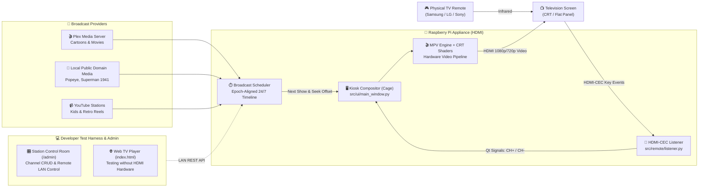

# Nostalgia TV 📺

<div align="center">

```text
███╗   ██╗ ██████╗ ███████╗████████╗ █████╗ ██╗      ██████╗ ██╗ █████╗     ████████╗██╗   ██╗
████╗  ██║██╔═══██╗██╔════╝╚══██╔══╝██╔══██╗██║     ██╔════╝ ██║██╔══██╗    ╚══██╔══╝██║   ██║
██╔██╗ ██║██║   ██║███████╗   ██║   ███████║██║     ██║  ███╗██║███████║       ██║   ██║   ██║
██║╚██╗██║██║   ██║╚════██║   ██║   ██╔══██║██║     ██║   ██║██║██╔══██║       ██║   ╚██╗ ██╔╝
██║ ╚████║╚██████╔╝███████║   ██║   ██║  ██║███████╗╚██████╔╝██║██║  ██║       ██║    ╚████╔╝ 
╚═╝  ╚═══╝ ╚═════╝ ╚══════╝   ╚═╝   ╚═╝  ╚═╝╚══════╝ ╚═════╝ ╚═╝╚═╝  ╚═╝       ╚═╝     ╚═══╝  
```

**Dedicated Raspberry Pi retro TV appliance connected via HDMI, controlled by your TV remote over HDMI-CEC.**

[](https://github.com/bgenome/nostalgia-tv/actions/workflows/ci.yml)
[](#-raspberry-pi-hardware-setup)
[](#-tv-remote-controls-hdmi-cec)
[](#-features)
[](https://opensource.org/licenses/MIT)
[](https://www.python.org/)

[Quick Start](#-quick-start-raspberry-pi) • [Hardware Setup](#-raspberry-pi-hardware-setup) • [HDMI-CEC Remote](#-tv-remote-controls-hdmi-cec) • [Architecture](#-system-architecture) • [Testing Harness & Admin](#-developer-testing-harness--web-admin) • [Plex & YouTube](#-media-sources)

</div>

---

## 🎯 What is Nostalgia TV?

**Nostalgia TV is an appliance, not a web app.** 

It is designed first and foremost to turn a **Raspberry Pi connected to your television via HDMI** into an authentic, standalone 1990s television broadcast receiver.

You plug the Pi into your TV's HDMI port, turn on the TV, grab your **actual physical TV remote control** (Samsung, LG, Sony, Philips, etc.), and flip through channels using **Channel Up / Channel Down**. 

- **No keyboard, mouse, or touch screen required**: Your television's existing infrared remote sends commands over the HDMI cable via **HDMI-CEC** directly to the Pi.
- **Instant Boot to TV**: Runs as a lightweight systemd service inside the `cage` Wayland kiosk compositor on Raspberry Pi OS Lite, booting straight into full-screen video playback with an authentic retro green On-Screen Display (OSD).
- **Synchronized 24/7 Linear Broadcasts**: Shows air continuously based on a synchronized timeline—tune in at 4:15 PM and the 4:00 PM episode of your favorite 90s cartoon is already 15 minutes in.
- **Hardware-Accelerated MPV + CRT Shaders**: Renders video with GLSL CRT shaders (scanlines, phosphor mask, barrel distortion) and retro station bumpers.
- **Developer Test Harness Included**: A browser-based web player and Station Control Console are included to make local testing, channel editing, and Plex library imports easy from any laptop or smartphone on the local network.

---

## 📺 How It Works



---

## 🚀 Quick Start (Raspberry Pi)

### 1. Hardware Requirements
- **Raspberry Pi**: Pi 5, Pi 4B, Pi 3B+, or Pi Zero 2W.
- **Display**: Any TV or CRT display with HDMI input (or HDMI-to-Composite converter) supporting HDMI-CEC.
- **Remote**: Your television's standard physical remote control.
- **OS**: The flashable image is 64 bit Raspberry Pi OS Lite.

### 2. Flashable image

The commercial artifact is a Raspberry Pi image. Build it with one command. The image file is too large to commit.

```bash
sudo ./image/build-image.sh
```

Buyers flash that image and follow [docs/FLASH.md](docs/FLASH.md). The image boots `main.py` from `nostalgia-tv.service`. It plays a Plex server or local files. YouTube is not installed on it.

`scripts/setup_kiosk.sh` is a developer installer for a Pi you already administer over SSH. It does not produce a flashable image.

### 3. Developer installer
SSH into a Raspberry Pi you already administer and clone the repository:

```bash
git clone https://github.com/bgenome/nostalgia-tv.git
cd nostalgia-tv
```

Run the automated kiosk setup script:

```bash
chmod +x scripts/setup_kiosk.sh
./scripts/setup_kiosk.sh
```

This script:
1. Installs minimal kiosk display dependencies: `cage`, `mpv`, `libmpv-dev`, `cec-utils`, `python3-pyqt6`, `libcec-dev`.
2. Creates a Python virtual environment and installs required drivers.
3. Installs and enables the `nostalgia-tv.service` systemd daemon.

### 4. Launch the developer installer
```bash
sudo systemctl start nostalgia-tv
```
Your TV will switch on and start broadcasting immediately in fullscreen kiosk mode!

---

## 🎮 TV Remote Controls (HDMI-CEC)

Nostalgia TV uses `python-cec` to listen to native Consumer Electronics Control commands passed through the HDMI cable:

| Physical TV Remote Button | Nostalgia TV Action |
| :--- | :--- |
| **<kbd>CH +</kbd>** / **<kbd>Channel Up</kbd>** | Next Broadcast Station |
| **<kbd>CH -</kbd>** / **<kbd>Channel Down</kbd>** | Previous Broadcast Station |
| **<kbd>▲</kbd> Up** / **<kbd>▼</kbd> Down** | Next / Previous Channel |
| **<kbd>Select</kbd>** / **<kbd>OK</kbd>** / **<kbd>Enter</kbd>** | Display Channel Info & Retro Green OSD |
| **<kbd>Back</kbd>** / **<kbd>Exit</kbd>** / **<kbd>Return</kbd>** | Dismiss On-Screen Display |
| **<kbd>Power</kbd>** | Puts TV in Standby |

> [!TIP]
> **Enabling HDMI-CEC on Your TV**:
> Ensure HDMI Control is enabled in your TV's system settings:
> - **Samsung**: *Anynet+* (Settings → General → External Device Manager → Anynet+)
> - **LG**: *SIMPLINK* (Settings → All Settings → General → SIMPLINK)
> - **Sony**: *BRAVIA Sync* (Settings → External Inputs → BRAVIA Sync Settings)
> - **Philips**: *EasyLink*
> - **TCL / Roku**: *1-Touch Play & System Audio Control*

---

## 🛠️ Testing HDMI-CEC on the Pi

You can verify that your television remote is talking to the Raspberry Pi over HDMI using `cec-client`:

```bash
# Scan for connected CEC devices (your TV will show as Device 0)
cec-client -l

# Monitor live key presses from your remote control
cec-client
```
When pressing buttons on your TV remote, you will see keycode events such as `key pressed: channel up (30)`. Nostalgia TV's [`src/remote/listener.py`](src/remote/listener.py) automatically routes these events to the channel switching engine.

---

## 🧪 Developer Testing Harness & Web Admin

The project includes a lightweight HTTP broadcast server and web UI (`server.py`) **built specifically to make testing easy without requiring physical HDMI hardware**:

### Running the Test Harness on your PC / Mac
```bash
# Start the broadcast test server (Zero external pip dependencies required!)
python3 server.py
```

Then open your browser:
- 📺 **Web TV Player** ([http://localhost:8080](http://localhost:8080)): Simulates the Raspberry Pi display inside your browser with CSS/Canvas CRT shaders, channel dials, volume knobs, and synthesized static burst audio.
- 🎛️ **Station Control Room Console** ([http://localhost:8080/admin](http://localhost:8080/admin)): Full control room to inspect live streams, add/edit channels, browse Plex libraries, and manage YouTube station playlists.

---

## 🎬 Media Sources

Nostalgia TV pulls content from multiple sources to create continuous broadcast channels:

### 1. Plex Media Server
Connect to your home Plex server to broadcast your personal media library:
- Configure server IP and token in [`data/plex_config.json`](data/plex_config.json) or through the Admin Panel (`/admin`).
- Automatically scans cartoons, movies, and bumpers into 24/7 rotating lineups.
- Includes built-in demo fallback mode for offline testing.

### 2. Public Domain Starter Media
Download classic 1940s Superman, Popeye, Felix the Cat, and vintage commercial reels directly:
```bash
python3 download_public_domain_media.py
```

### 3. YouTube Stations
Turn YouTube playlists or channels into linear scheduled stations with range-request streaming.

---

## 📁 Repository Structure

```text
nostalgia-tv/
├── image/
│   ├── build-image.sh             # One command that emits the flashable image
│   └── stage-nostalgia/           # pi-gen stage installed on that image
├── docs/
│   └── FLASH.md                   # Buyer flash guide
├── scripts/
│   ├── setup_kiosk.sh             # Developer SSH installer, not the flashable image
│   ├── nostalgia-tv.service       # Systemd unit used by the developer installer
│   └── run_plex_docker.sh         # Optional local Plex server container
├── shaders/
│   └── crt-easymode.glsl          # GLSL CRT shader for MPV video pipeline
├── src/
│   ├── remote/
│   │   └── listener.py            # HDMI-CEC TV remote listener (Qt signals)
│   ├── ui/
│   │   └── main_window.py         # Fullscreen PyQt6 + MPV kiosk player
│   ├── engine/
│   │   └── scheduler.py           # Epoch-aligned 24/7 broadcast timeline
│   ├── config/
│   │   └── parser.py              # Channel YAML/JSON configuration parser
│   ├── plex/
│   │   └── client.py              # Plex Media Server client & demo engine
│   └── youtube/
│   └── client.py                  # YouTube station syncer & stream provider
├── tests/
│   ├── test_broadcast_engine.py   # Broadcast engine & timeline tests
│   ├── test_plex_client.py        # Plex client integration tests
│   ├── test_youtube_client.py     # YouTube client tests
│   └── test_server_api.py         # REST API & server tests
├── web/                           # Developer test harness & admin UI
│   ├── index.html                 # Browser-based test player (CRT simulation)
│   └── admin.html                 # Remote Station Control Room
├── main.py                        # Primary entrypoint for Raspberry Pi Kiosk
├── server.py                      # Standalone test server & Admin API
├── download_public_domain_media.py# Starter media downloader
├── requirements.txt               # Kiosk & CEC dependencies
└── pyproject.toml                 # Project metadata & tool config
```

---

## ⌨️ Desktop Keyboard Controls (When Testing Without CEC)

When testing `main.py` on a PC or Mac desktop:

| Key | Action |
| :--- | :--- |
| <kbd>↑</kbd> / <kbd>↓</kbd> | Channel Up / Channel Down |
| <kbd>Esc</kbd> / <kbd>Q</kbd> | Exit Kiosk |
| <kbd>F</kbd> | Toggle Fullscreen |

---

## 🧪 Automated Testing

Nostalgia TV includes a comprehensive automated test suite testing the broadcast engine, Plex integration, YouTube syncer, and API:

```bash
# Run tests with Python's built-in test runner (Zero dependencies)
python3 -m unittest discover -s tests -v

# Or run with pytest
pytest tests/ -v
```

---

## 🤝 Contributing

Contributions are warmly welcome! Whether you are:
- Enhancing HDMI-CEC key mappings or CEC wake-on-power features
- Optimizing MPV performance and GLSL CRT shaders for Raspberry Pi GPU
- Adding Jellyfin / Emby broadcast providers
- Improving the systemd kiosk boot sequence

Please see [CONTRIBUTING.md](CONTRIBUTING.md) to get started.

---

## 📜 License

This project is licensed under the MIT License - see the [LICENSE](LICENSE) file for details.

---

<div align="center">

Made with nostalgic love for the golden age of television 📺✨

</div>
