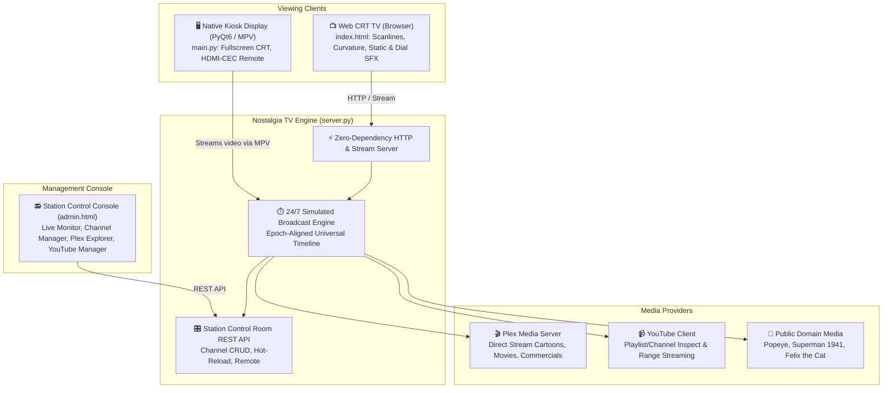

# Nostalgia TV 📺

<div align="center">

```text
███╗   ██╗ ██████╗ ███████╗████████╗ █████╗ ██╗      ██████╗ ██╗ █████╗     ████████╗██╗   ██╗
████╗  ██║██╔═══██╗██╔════╝╚══██╔══╝██╔══██╗██║     ██╔════╝ ██║██╔══██╗    ╚══██╔══╝██║   ██║
██╔██╗ ██║██║   ██║███████╗   ██║   ███████║██║     ██║  ███╗██║███████║       ██║   ██║   ██║
██║╚██╗██║██║   ██║╚════██║   ██║   ██╔══██║██║     ██║   ██║██║██╔══██║       ██║   ╚██╗ ██╔╝
██║ ╚████║╚██████╔╝███████║   ██║   ██║  ██║███████╗╚██████╔╝██║██║  ██║       ██║    ╚████╔╝ 
╚═╝  ╚═══╝ ╚═════╝ ╚══════╝   ╚═╝   ╚═╝  ╚═╝╚══════╝ ╚═════╝ ╚═╝╚═╝  ╚═╝       ╚═╝     ╚═══╝  
```

**Turn any display, Raspberry Pi, or web browser into an authentic 1990s CRT television broadcast network.**

[](https://github.com/bgenome/nostalgia-tv/actions/workflows/ci.yml)
[](https://www.python.org/)
[](https://opensource.org/licenses/MIT)
[](#quick-start)
[](#running-with-docker)
[](#kiosk-hardware-setup)

[Features](#-key-features) • [Quick Start](#-quick-start) • [Architecture](#-architecture) • [Station Control Room](#-station-control-room-admin-panel) • [Plex & YouTube](#-media-sources) • [Hardware & Kiosk](#-kiosk--hardware-setup) • [Contributing](#-contributing)

</div>

---

## 📻 What is Nostalgia TV?

Remember turning on the TV in the 90s, hearing the high-pitch CRT flyback hum, flipping past the scrolling Prevue Channel guide, and catching your favorite after-school cartoons already in progress? 

**Nostalgia TV** recreates that authentic linear broadcast experience:
- **Synchronized 24/7 Broadcast Engine**: Programs air continuously on a timeline based on epoch time. When you tune in at 4:15 PM, the 4:00 PM episode is already 15 minutes in—just like real broadcast television.
- **Authentic CRT Shaders & Sound**: WebGL / Canvas / CSS3 shaders produce barrel glass curvature, dynamic scanlines, phosphor glow, subtle glass glare, channel-flip static bursts, and synthesized analog click/pop audio.
- **Prevue Channel Guide**: A dynamic, authentic scrolling program guide showing current and upcoming shows across all your channels.
- **Zero External Dependencies**: The standalone broadcast server and web TV player run out of the box with pure Python standard library!
- **Plex & YouTube Integration**: Seamlessly pulls content from your local Plex Media Server or streams scheduled YouTube playlists.
- **Kiosk & Hardware Support**: Native PyQt6 + MPV fullscreen mode with HDMI-CEC TV remote control support for Raspberry Pi, Mac, and dedicated CRT setups.

---

## 📺 Key Features

| Feature | Description |
| :--- | :--- |
| **🕹️ Simulated Broadcast Engine** | Computes 24/7 continuous programming without re-encoding video. Everyone watching is in sync. |
| **✨ CRT TV Visuals & Audio** | Scanlines, bulbous tube curvature, phosphor mask, corner vignette, static noise, and mechanical dial clicks. |
| **📋 Prevue TV Guide Channel** | Continuous scrolling schedule matrix displaying what is playing *Now*, *Next*, and *Later*. |
| **🎛️ Station Control Room** | Modern retro-styled web admin panel (`/admin`) with live monitor, channel CRUD, and remote control. |
| **🎬 Plex Media Server Integration** | Auto-detects Plex cartoon & movie libraries, imports metadata, and serves direct streams with demo fallback. |
| **📹 YouTube Stations** | Syncs YouTube playlists/channels into scheduled broadcast channels with range streaming support. |
| **📺 Vintage Commercial Reels** | Plays station IDs, retro 90s commercials, and bumpers between scheduled shows. |
| **🎮 Native Desktop & Kiosk Mode** | PyQt6 + MPV client with blank cursor, auto-start systemd service, and HDMI-CEC remote control. |

---

## 🏗️ Architecture



---

## ⚡ Quick Start

### 1. Launch in 10 Seconds (Zero Dependencies)
Clone the repository and run the standalone server:

```bash
# Clone the repository
git clone https://github.com/bgenome/nostalgia-tv.git
cd nostalgia-tv

# Start the broadcast server
python3 server.py
```

Then open your browser:
- 📺 **Watch Retro TV**: [http://localhost:8080](http://localhost:8080)
- 🎛️ **Station Control Room**: [http://localhost:8080/admin](http://localhost:8080/admin)

*(The server runs with built-in simulated demo broadcasts out of the box!)*

---

### 2. Download Public Domain Starter Media (Optional)
To populate real local video files (1940s Superman, Popeye, Felix the Cat, retro commercials):

```bash
python3 download_public_domain_media.py
```

---

### 3. Native Desktop Kiosk Mode (Optional)
For a dedicated Raspberry Pi, HTPC, or Mac desktop display:

```bash
pip install -r requirements.txt
python3 main.py
```

---

## 🐳 Running with Docker

You can run Nostalgia TV in an isolated container on any system:

```bash
# Build the container
docker build -t nostalgia-tv .

# Run container mapping port 8080 and local media
docker run -d \
  -p 8080:8080 \
  -v "$(pwd)/media:/app/media" \
  -v "$(pwd)/data:/app/data" \
  --name nostalgia-tv \
  nostalgia-tv
```

Or on macOS using the convenience script:
```bash
./run_docker_mac.sh
```

---

## 🎛️ Station Control Room (Admin Panel)

Access the broadcast control room at `http://<your-ip>:8080/admin`:

- 🖥️ **Live Station Monitor**: Real-time preview of what's currently airing across all stations.
- 📡 **Channel Manager**: Add, edit, reorder, or delete broadcast channels with instant hot-reload.
- 🎬 **Plex Media Explorer**: Browse your local Plex libraries and import any cartoon or movie series directly into a channel with one click.
- 📹 **YouTube Channel Manager**: Add YouTube playlist or channel URLs to broadcast kids songs, retro game playthroughs, or vintage commercials.
- 📋 **Prevue Guide Preview**: Inspect the 24/7 program guide grid for the current broadcast window.
- 🎚️ **Remote TV Controller**: Change channels, toggle CRT curvature, scanlines, or power on the main screen remotely.

---

## 🎬 Media Sources

### Plex Media Server Integration
Nostalgia TV connects to any local Plex Media Server:
1. Open the **Station Control Room** (`/admin`) and navigate to the **Plex Settings** tab.
2. Enter your Plex Server URL (`http://192.168.1.xxx:32400`) and your Plex Token (or toggle **Demo Mode** for instant simulation).
3. Browse libraries and click **"Import to TV Channel"**.

### YouTube Stations
Nostalgia TV can turn YouTube playlists or channels into linear TV stations:
1. Go to the **YouTube Channels** tab in the Control Room.
2. Paste any YouTube playlist or channel link (e.g. classic cartoon reels or educational shows).
3. The engine indexes video durations and broadcasts them seamlessly in schedule blocks.

---

## 🖥️ Kiosk & Hardware Setup

### Raspberry Pi / CRT Television
To turn a Raspberry Pi connected to a CRT or TV into a dedicated 24/7 retro television:

1. Connect the Pi to your TV via HDMI or composite video.
2. Clone Nostalgia TV and install requirements:
   ```bash
   sudo apt-get update && sudo apt-get install -y mpv libmpv-dev libcec-dev python3-pyqt6
   pip install -r requirements.txt
   ```
3. Run the kiosk setup script:
   ```bash
   ./scripts/setup_kiosk.sh
   ```
4. Enable the systemd service to boot straight into Nostalgia TV on power up:
   ```bash
   sudo cp scripts/nostalgia-tv.service /etc/systemd/system/
   sudo systemctl daemon-reload
   sudo systemctl enable nostalgia-tv.service
   sudo systemctl start nostalgia-tv.service
   ```

### HDMI-CEC Remote Control
When running on Linux or Raspberry Pi with HDMI-CEC enabled:
- **Channel Up / Down** buttons on your real TV remote change the channel.
- **Directional Up / Down** navigate the guide.

---

## ⌨️ Keyboard & TV Controls

When watching via the Web TV or Desktop Kiosk:

| Key / Control | Action |
| :--- | :--- |
| <kbd>↑</kbd> / <kbd>↓</kbd> or <kbd>CH+</kbd> / <kbd>CH-</kbd> | Next / Previous Channel |
| <kbd>1</kbd> - <kbd>9</kbd> | Direct Channel Tuning |
| <kbd>C</kbd> | Toggle CRT Barrel Curvature |
| <kbd>S</kbd> | Toggle Scanlines Overlay |
| <kbd>G</kbd> | Jump to Prevue Program Guide |
| <kbd>M</kbd> | Toggle Audio Mute |
| <kbd>F</kbd> | Fullscreen Mode |
| <kbd>P</kbd> | TV Power On / Off |

---

## 🧪 Testing

Nostalgia TV includes a comprehensive automated test suite testing the broadcast engine, Plex integration, YouTube syncer, and API:

```bash
# Run tests with Python's built-in test runner (Zero dependencies)
python3 -m unittest discover -s tests -v

# Or run with pytest
pytest tests/ -v
```

---

## 📁 Repository Structure

```text
nostalgia-tv/
├── .github/
│   ├── workflows/ci.yml           # Automated GitHub Actions test pipeline
│   ├── ISSUE_TEMPLATE/            # Bug report and feature request templates
│   └── pull_request_template.md   # Pull request guidelines
├── data/
│   ├── channels.json              # Active channel configuration & schedules
│   ├── channels.yaml              # Alternative YAML format
│   └── plex_config.json           # Plex server connection settings
├── media/                         # Media directories (.gitkeep preserved)
│   ├── Cartoons/
│   ├── Movies/
│   ├── Bumpers/
│   └── YouTube/
├── scripts/
│   ├── nostalgia-tv.service       # Systemd service for auto-boot kiosk
│   ├── run_plex_docker.sh         # Helper to run Plex in Docker
│   └── setup_kiosk.sh             # Linux kiosk setup script
├── shaders/
│   └── crt-easymode.glsl          # GLSL CRT shader
├── src/
│   ├── config/parser.py           # Configuration loader
│   ├── engine/scheduler.py        # Broadcast scheduler logic
│   ├── plex/client.py             # Plex Media Server client & demo engine
│   ├── remote/listener.py         # HDMI-CEC remote listener
│   ├── ui/main_window.py          # PyQt6 desktop kiosk window
│   └── youtube/client.py          # YouTube channel inspector & syncer
├── tests/
│   ├── test_broadcast_engine.py   # Broadcast engine & timeline tests
│   ├── test_plex_client.py        # Plex client integration tests
│   ├── test_youtube_client.py     # YouTube client tests
│   └── test_server_api.py         # REST API & server tests
├── web/
│   ├── index.html                 # Retro CRT Web TV Player
│   └── admin.html                 # Station Control Room Console
├── Dockerfile                     # Docker container definition
├── download_public_domain_media.py# Starter media downloader
├── pyproject.toml                 # Modern Python packaging configuration
├── requirements.txt               # Desktop kiosk dependencies
├── requirements-dev.txt           # Testing & linting dependencies
├── server.py                      # Standalone broadcast server (zero-pip!)
└── main.py                        # Native desktop kiosk entrypoint
```

---

## 🤝 Contributing

Contributions are warmly welcome! Whether you are:
- Improving CRT shader effects or audio synthesis
- Adding new channel guide themes or layouts
- Enhancing Plex / Jellyfin / Emby integrations
- Creating Raspberry Pi / hardware installation scripts

Please see [CONTRIBUTING.md](CONTRIBUTING.md) to get started.

---

## 📜 License

This project is licensed under the MIT License - see the [LICENSE](LICENSE) file for details.

---

<div align="center">

Made with nostalgic love for the golden age of television 📺✨

</div>
